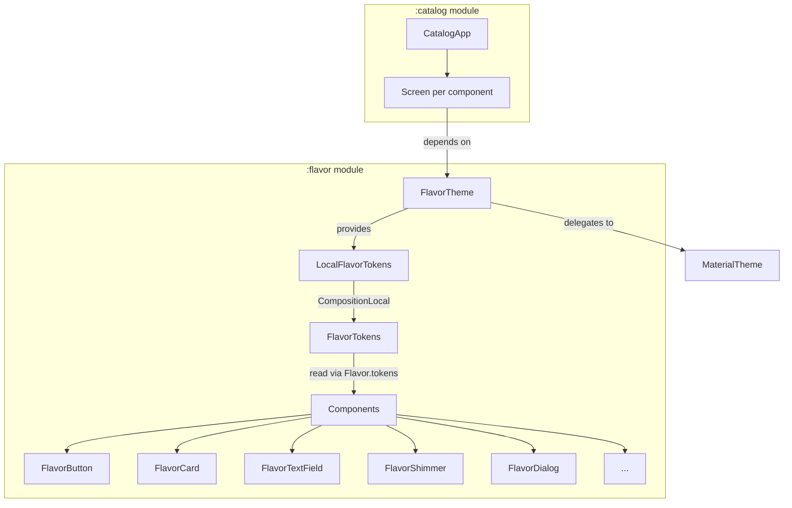

# Flavor — Android Design System

A Jetpack Compose component library built around a tokenized design system, with a companion catalog app that exercises every component. This is a portfolio project — one in a series, each focused on a different competency expected of a senior mobile engineer. This one covers **design systems**: how to build a consistent, extensible component layer that scales across teams and brands.

I'm primarily a Flutter engineer. I built this in Compose/Kotlin deliberately — design-system thinking shouldn't be locked to one framework, and the underlying problems (token management, API consistency, theming contracts) are the same regardless of toolkit.

<!-- TODO: Add 2-4 catalog screenshots
     Suggested captures:
     - Catalog home screen (light mode)
     - Button screen showing all 5 variants + loading state
     - Shimmer/Skeleton screen
     - Any one screen in dark mode
     Place images in a /screenshots directory and reference them here.
-->

## Why a design system

In every codebase I've worked on that lacked a design system, the same problems appeared: hardcoded colors that broke in dark mode, inconsistent spacing that made screens feel off, loading states that looked different on every page, and no shared language between design and engineering. Adding a new screen meant copying and tweaking from an existing one, which meant bugs propagated and visual drift compounded.

This project is my answer to those problems, scoped to the parts I think matter most: a token layer that centralizes design decisions, components with enforced API conventions, and a catalog app that proves the components actually work together.

## Key decisions

### Token layer over raw Material 3

Material 3 provides a color system, typography scale, and shape system out of the box. I chose to add `FlavorTokens` — an `@Immutable data class` delivered via `CompositionLocal` — on top of it for spacing, radius, elevation, and icon sizing. These are the values Material 3 doesn't opinionated for you, and they're exactly the ones that drift across a codebase when left to individual developers.

The tradeoff: it's another layer of indirection. Every component reads `Flavor.tokens.spacingMd` instead of writing `16.dp`. That's more code for the same result — until you need to support a second brand, or a design refresh changes your spacing scale, and you change it in one place instead of across every file. The token class also accepts overrides through `FlavorTheme(tokens = ...)`, so per-tenant theming is a constructor call, not a fork.

I deliberately kept color and typography tokens out. Material 3's `colorScheme` and `typography` already handle those well, and duplicating them would add indirection without solving a real problem.

### API conventions as enforcement

Every composable in this library follows the same contract:
- `modifier: Modifier = Modifier` is always the first optional parameter
- No hardcoded colors — everything goes through `MaterialTheme.colorScheme`
- No raw `Dp` literals for spacing, radius, or elevation — everything goes through `Flavor.tokens`
- No `android.*` imports beyond `Configuration` (for preview annotations)
- Light and dark `@Preview` on every component

These rules are more valuable than any individual component. A design system that doesn't enforce its own conventions teaches the wrong habits. I wanted the library to be an example of the discipline, not just the output.

### Library and catalog as separate modules

The `:catalog` module is a standalone app that depends on `:flavor` via `implementation(project(":flavor"))`. This isn't just a demo — it's a constraint. The catalog can only use public API, which forces me to notice when a component's interface is awkward or incomplete. If I can't build a reasonable demo screen without reaching into internals, the API needs work.

The catalog also uses type-safe navigation (Navigation 2.8+ with `@Serializable` route objects), which keeps the demo app itself idiomatic rather than a throwaway.

## Architecture

`FlavorTheme` wraps `MaterialTheme` and injects the token `CompositionLocal`. Components read tokens via `Flavor.tokens` — a short accessor on the `Flavor` object. Consumers can override tokens at the theme level without touching component code.

## What's here

| Component | Wraps | Notable |
|---|---|---|
| `FlavorButton` | Button, FilledTonalButton, OutlinedButton, TextButton | 5 style variants via enum; loading state auto-disables and shows spinner |
| `FlavorCard` | Card, OutlinedCard | 3 styles; optional `onClick` switches between clickable and static variants |
| `FlavorTextField` | OutlinedTextField | Trailing icon supports optional click handler; error state with supporting text |
| `FlavorDialog` | AlertDialog | Destructive mode colors confirm button with `error` |
| `FlavorBottomSheet` | ModalBottomSheet | Exposes `SheetState` for caller control |
| `FlavorShimmer` | — (custom) | Animated gradient sweep; theme-aware colors adapt to light/dark |
| `FlavorCardSkeleton` | FlavorShimmer | Compositional — image + title + subtitle layout |
| `FlavorListItemSkeleton` | FlavorShimmer | Compositional — circular avatar + two text lines |
| `FlavorEmptyView` | — | Full-screen empty state; reuses `FlavorButton` for CTA |
| `FlavorErrorView` | — | Full-screen error state with optional retry |

Every component has a matching Compose UI test in `androidTest` and a dedicated catalog screen.

## What's not here (and why)

This is a scoped demonstration, not an attempt to replace Material 3.

- **No typography or color tokens.** Material 3 handles these well. Duplicating them would add indirection without solving a problem.
- **No navigation drawers, tabs, chips, snackbars, top bars.** The component set covers different interaction models (input, action, feedback, loading, overlay) rather than trying to be exhaustive. Ten well-built components with consistent conventions demonstrate the system better than forty inconsistent ones.
- **No Compose Multiplatform.** This targets Android only. Cross-platform design systems are a different problem with different tradeoffs — worth a separate project.
- **No runtime theme switching UI.** The token system supports it (pass different `FlavorTokens` to `FlavorTheme`), but building a theme picker would be catalog polish, not a design-system concern.

## What I'd change

- **Add screenshot tests.** The Compose UI tests verify behavior (clicks fire, loading disables, tokens propagate) but don't catch visual regressions. Paparazzi or Roborazzi would close that gap.
- **Add accessibility test coverage.** Components inherit Material 3's semantics, but I'm not explicitly testing content descriptions, touch targets, or screen reader behavior. That's a gap.
- **Tighten the skeleton components.** `FlavorCardSkeleton` and `FlavorListItemSkeleton` still have a few raw `Dp` literals (e.g., `160.dp` for image height, `48.dp` for avatar size) that should be tokens. I caught this pattern elsewhere but missed it in the skeletons.
- **Generate Compose stability reports.** The `@Immutable` annotation on `FlavorTokens` helps, but I haven't configured the Compose compiler stability report to verify that all components are actually skippable. Worth adding for a library where recomposition performance matters.

## Stack

- Kotlin 2.1.21, Compose BOM 2025.05.01, Material 3
- `compileSdk 35`, `minSdk 26`, JVM target 17
- Navigation Compose 2.9 with `@Serializable` type-safe routes
- GitHub Actions CI — builds both modules, runs tests and lint on every push/PR
- Maven Central publishing pipeline (GPG signing, Sonatype OSSRH, POM metadata)
- Version catalog (`libs.versions.toml`) for all dependency management

## License

[Apache 2.0](https://www.apache.org/licenses/LICENSE-2.0)
